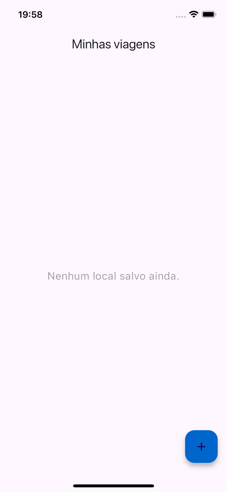
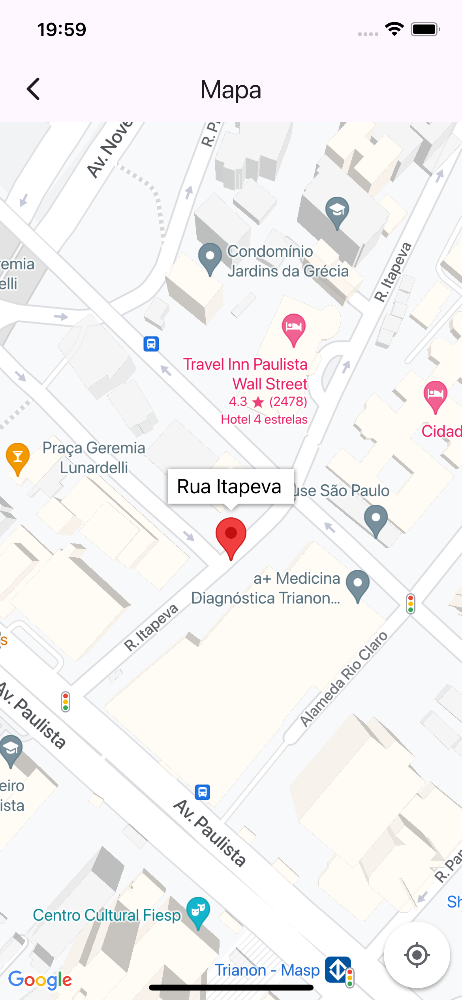
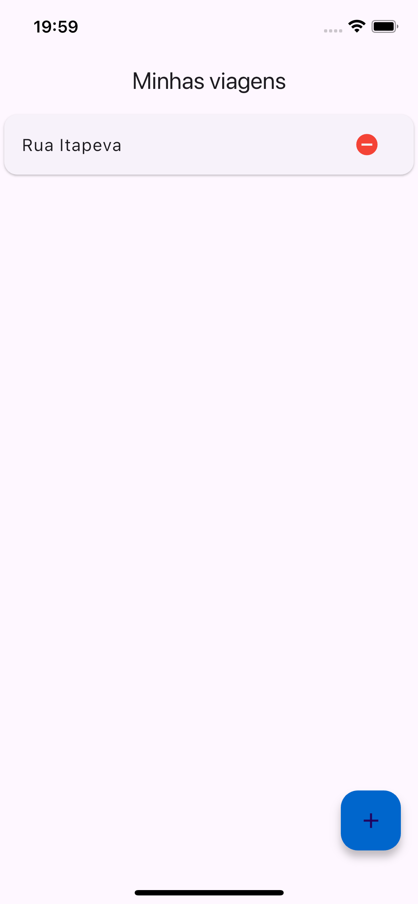

# App Minhas Viagens

## Descrição

Um aplicativo simples com uma lista de localizações salvas que foi desenvolvido durante o curso de Desenvolvimento Flutter Mobile.

## Curso

**Desenvolvimento Android e IOS com Flutter - Crie 15 Apps**

[Link para o curso na Udemy](https://www.udemy.com/course/desenvolvimento-android-e-ios-com-flutter/?couponCode=MCLARENT71824)

## Status do Projeto

- **Concluído:** 12/10/2021
- **Atualizado:** 30/07/2024

## Tecnologias Utilizadas


## Funcionalidades

- Tela SplashScreen
- Tela de locais salvos
- Mapa para salvar novos locais

## Instalação

Siga os passos abaixo para rodar o projeto localmente:

1. Clone o repositório:
    ```sh
    git clone https://github.com/rafaelleonan/app-flutter-minhas-viagens.git
    ```
2. Navegue até o diretório do projeto:
    ```sh
    cd app-flutter-minhas-viagens
    ```
3. Instale as dependências:
    ```sh
    flutter pub get
    ```
4. Configure o Firebase para o seu projeto:
   - Siga as instruções no [Firebase Console](https://console.firebase.google.com/)
   - Adicione os arquivos de configuração `google-services.json` (Android) e `GoogleService-Info.plist` (iOS)

5. Execute o aplicativo:
    ```sh
    flutter run
    ```

## Telas
<p>
  
  
  
  
</p>

## Video Demonstração
[Assista o vídeo](https://uc75ce27b5d64b78fd08fc701b76.dl.dropboxusercontent.com/cd/0/inline/CXzLHR3HAhaA6Ke9t98ht_gG0Hv16r0STUKwStInW-xk5XMesyNtC8dUMcyfnCYgcFhwy9Ce1Zus7tQBJuOl6apj7LmX_jZVO78Oxcqcz_xK9EeHDHBburvJZ3RKITd1sQmkPrFchu-X35Wv0cLk4Il4/file#)
